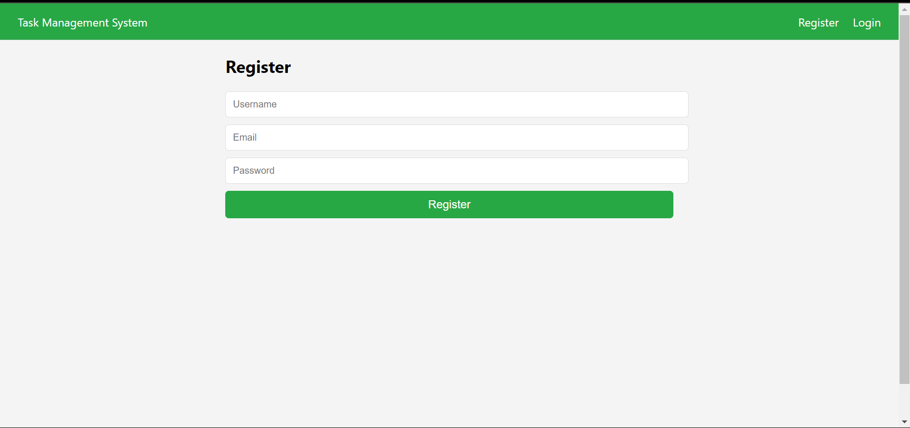
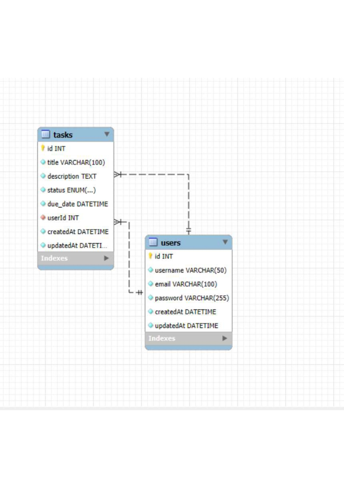

# TASK_MANAGEMENT_SYSTEM

Deployment URL
Front-End:https://task-management-system-3dtwa26q6.vercel.app/tasks 

Overview
Library_management_system Pages:
The Task Management System is designed to help users efficiently manage their tasks through a user-friendly web application. Users can register, log in, and perform various task-related actions, such as creating, viewing, editing, and deleting tasks. Each task will include a title, description, status, and due date. The frontend, built with React and TypeScript, includes pages for authentication and a task dashboard, ensuring a responsive design for both mobile and desktop devices. The backend, developed using Node.js and TypeScript, implements JWT-based authentication, CRUD operations for tasks, and a SQL database schema for storing user and task data  making the application robust and efficient.

(./assets/list.png)
Features
Responsive UI

Clean and responsive design for a seamless user experience.
Authentication

Secure authentication system utilizing JWT access and refresh tokens.

All crud operation:

Add task:
user can add any number of task.

Edit task:
user can edit any  of task made changes in status of task.

Delete task:

user delete task.

Comprehensive error handling for graceful recovery and detailed logging for efficient debugging and maintenance.

Technologies Used:
Front-end
React.js: Utilized React.js for building a dynamic and interactive user interface.

 CSS: Employed CSS for efficient and responsive designs.

Query: Leveraged sql Query for streamlined and efficient data fetching.

Back-end
Express.js: Employed Express.js to create a robust and scalable RESTful API.

MYSQL: Utilized MongoDB as the database to store and retrieve data, ensuring persistent and reliable data storage for the application.

How to Run
Clone the Repository:

git clone https://github.com/jyotipatthak/task_management_system/tree/main

## Install the dependencies:

Install the dependencies of React App
cd front-end && npm i
Install the dependencies of express API and insert the task  into database
cd backend && npm i && npm run start

Running the Project Locally: Navigate to the project's root directory and run the following commands

Run the express server
npm run start

Run the react server

npm run start
OR

The React development server will be accessible at http://localhost:3000.

The Express server will be accessible at http://localhost:5000.

API Documentation
Explore the API endpoints and understand how to interact with the task_management_system API.

https://task-management-system-qrgm.onrender.com/api-docs

Database Entity Relationship (ER) Diagram

ER-Diagram

Developer Info
Name: jyoti kumari
GitHub: https://github.com/jyotipatthak

